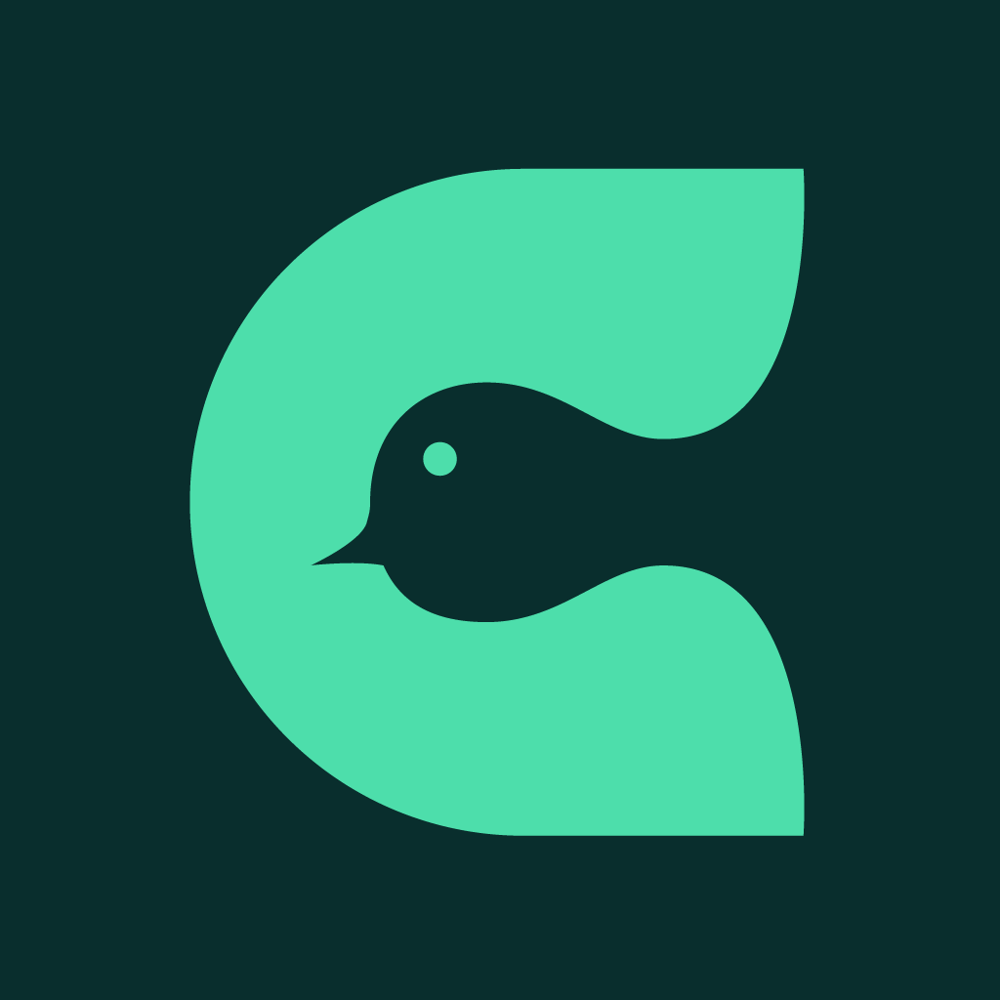
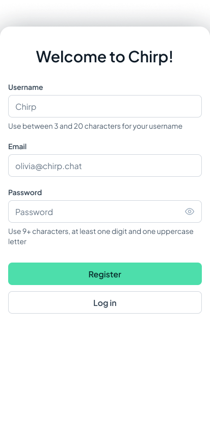
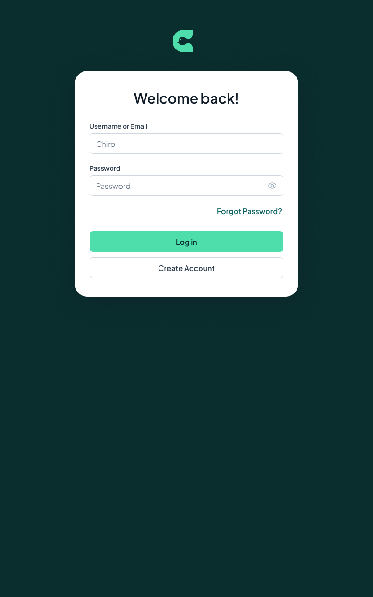
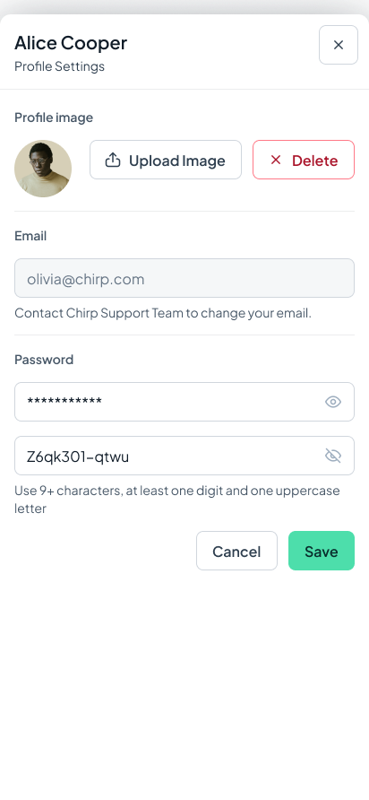
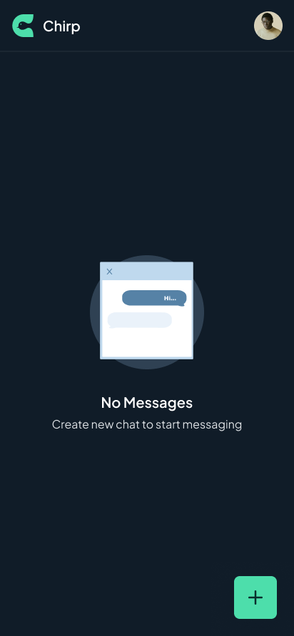
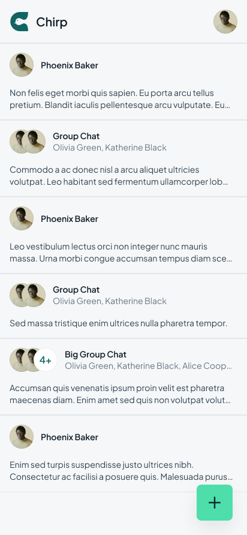
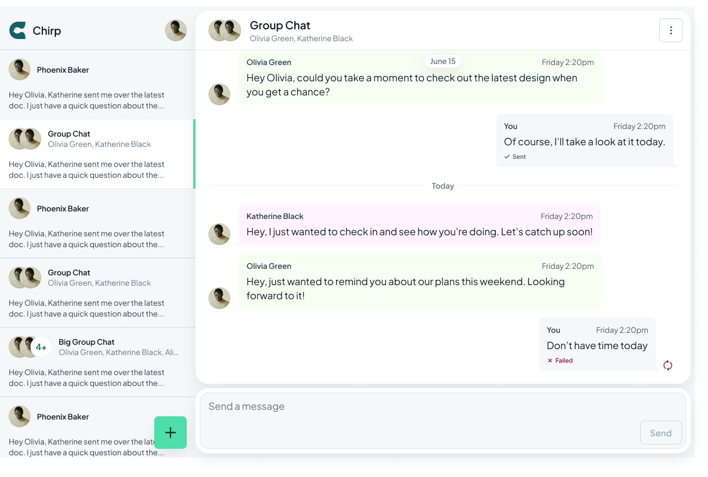
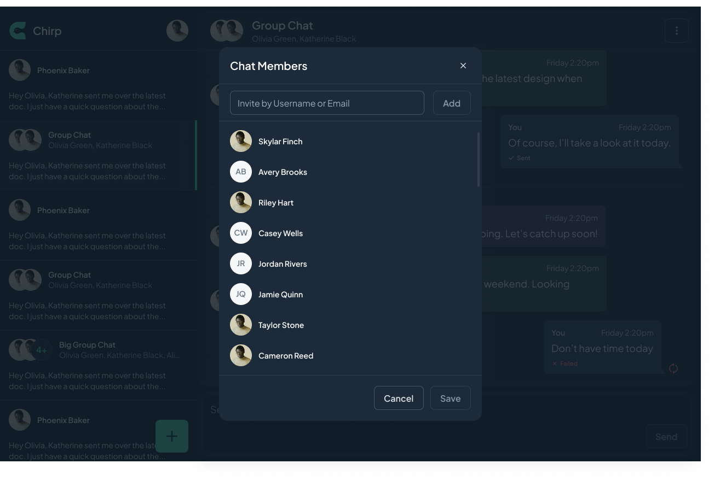

# Chirp

<p align="center">  
    
</p>  

<p align="center">  
  A modern, cross-platform messaging application built with Kotlin Multiplatform and Compose Multiplatform, targeting Android, iOS, and Desktop.  
</p>  

<p align="center">  
    
    
    
    
</p>  

<p align="center">  
    
    
    
</p> 

## About This Project

This application is a comprehensive implementation of a cross-platform chat solution, built to
demonstrate mastery of **Kotlin Multiplatform (KMP)** and **Compose Multiplatform (CMP)**.

It implements industry-standard practices including:

- **Kotlin Multiplatform (KMP)** architecture for shared business logic.

- **Compose Multiplatform (CMP)** for 100% shared UI across platforms.

- **Multi-module** Gradle setup following best practices.

- **Offline-first** architecture with robust data synchronization.

- **Real-time** messaging using WebSockets.

## Table of Contents

- [Features](#features)
- [Roadmap (Extended Features)](#roadmap-extended-features)
- [Screenshots](#screenshots)
- [Tech Stack](#tech-stack)
- [Architecture](#architecture)
- [Quick Start](#quick-start)
- [Documentation](#documentation)
- [Contributing](#contributing)
- [Acknowledgment](#acknowledgment)
- [License](#license)
- [Changelog](#changelog)

## Features

### Authentication & Profile

- 🔐 **Secure Auth** — Registration, Login, and Session Management with auto-refresh.

- 📧 **Email Verification** — Deep linking support for verifying email addresses.

- 🔄 **Password Recovery** — "Forgot Password" flow via email and deep links.

- 📸 **Profile Management** — Native photo picking (Android/iOS/Desktop) and image uploads.

### Messaging & Connectivity

- ⚡ **Real-time Chat** — WebSockets for instant message delivery.

- 📡 **Offline-First** — Local database caching (Room/SQLite) allows full app usage without internet.

- 📄 **Pagination** — Efficient data loading for chat history and lists.

- 🔔 **Push Notifications** — Firebase Cloud Messaging (Android/iOS) and local notifications (
  Desktop).

- 📱 **Cross-platform Sync** — Seamless state synchronization across all 5 platforms.

### Internationalization & UI

- 🌍 **Multilingual** — Full support for English and Arabic (RTL).

- 🌗 **Theming** — 100% responsive UI with Light and Dark modes.

- 🔤 **Dynamic Typography** — Cairo font for Arabic, Plus Jakarta Sans for Latin scripts.

### Platform Features

- 🖥️ **Desktop Support** — Native Windows, macOS, and Linux apps.

- 📦 **Distribution** — Installers via Conveyor.

# Roadmap: Extended Features

Having established the core foundation, I am now focused on integrating advanced features to further
refine the architecture and tackle complex, real-world engineering challenges.

### 🔐 Advanced Security

- [ ] **Local Data Encryption**
    - [ ] Android: Encrypt data using Android Keystore System
    - [ ] iOS: Secure storage via Keychain Services
    - [ ] Desktop: Integration with Windows Credential Manager, macOS Keychain, and Linux Secret
      Service

### 🎤 Rich Media & Audio

- [ ] **Voice Messages**
    - [ ] Audio recording implementation
    - [ ] Waveform visualization
    - [ ] Scrubbing and playback controls
    - [ ] Background playback support
- [ ] **Image Attachments**
    - [ ] Multiple image selection (up to 10)
    - [ ] Automatic compression
    - [ ] Upload progress indicators
    - [ ] Full-screen interactive viewer

### ⚡ Real-Time Enhancements

- [ ] **Typing Indicators**
    - [ ] Visual cues for single user typing
    - [ ] "Several people are typing" support
- [ ] **Smart Verification**
    - [ ] Auto-detection of unverified users during login
    - [ ] Automatic trigger for verification emails

### 👮 Chat Administration

- [ ] **Admin Roles**
    - [ ] Group creator assignment as Admin
- [ ] **Moderation**
    - [ ] Member removal functionality
- [ ] **Group Management**
    - [ ] Cascade deletion logic (if Admin leaves)
    - [ ] Warning dialogs for destructive actions

## Screenshots

> **Note:** These screenshots showcase key features but do not represent every screen in the
> application.

### Splash Screen

<p align="center">
  
</p>

### Authorization

<table>
  <tr>
    <td align="center">
      <strong>Register</strong><br/>
      
    </td>
    <td align="center">
      <strong>Register + Success</strong><br/>
      
    </td>
    <td align="center">
      <strong>Login (Tablet)</strong><br/>
      
    </td>
  </tr>
</table>

### Profile Settings

<p align="center">
  
</p>

### Chat

<table>
  <tr>
    <td align="center">
      <strong>Empty Chat</strong><br/>
      
    </td>
    <td align="center">
      <strong>Chat List</strong><br/>
      
    </td>
  </tr>
</table>

<table>
  <tr>
    <td align="center">
      <strong>Inside Chat (Desktop)</strong><br/>
      
    </td>
    <td align="center">
      <strong>Chat Members (Desktop)</strong><br/>
      
    </td>
  </tr>
</table>

## Tech Stack

### Core Technologies

| Category              | Technology                                                                   | Version      |  
|-----------------------|------------------------------------------------------------------------------|--------------|  
| Language              | [Kotlin](https://kotlinlang.org/)                                            | 2.2.0        |  
| UI Framework          | [Compose Multiplatform](https://www.jetbrains.com/lp/compose-multiplatform/) | 1.9.0-beta01 |  
| Compose BOM           | [Jetpack Compose BOM](https://developer.android.com/jetpack/compose/bom)     | 2025.07.00   |  
| Android Gradle Plugin | AGP                                                                          | 8.11.1       |  
| KSP                   | [Kotlin Symbol Processing](https://github.com/google/ksp)                    | 2.2.0-2.0.2  |  

### Libraries & Frameworks

| Category             | Library                                                                           | Purpose                           |  
|----------------------|-----------------------------------------------------------------------------------|-----------------------------------|  
| Dependency Injection | [Koin](https://insert-koin.io/)                                                   | Multiplatform DI                  |  
| Networking           | [Ktor Client](https://ktor.io/)                                                   | REST & WebSockets                 |  
| Database             | [Room](https://developer.android.com/training/data-storage/room)                  | Local persistence (Offline-first) |  
| SQLite               | [SQLite Bundled](https://github.com/nicbell/sqlite-android)                       | 2.5.2                             |  
| Preferences          | [DataStore](https://developer.android.com/topic/libraries/architecture/datastore) | Key-value storage                 |  
| Async                | [Coroutines](https://kotlinlang.org/docs/coroutines-overview.html) + Flow         | Concurrency                       |  
| Date/Time            | [kotlinx-datetime](https://github.com/Kotlin/kotlinx-datetime)                    | Multiplatform dates               |  
| Images               | [Coil 3](https://coil-kt.github.io/coil/)                                         | Image loading & Caching           |  
| Permissions          | [moko-permissions](https://github.com/icerockdev/moko-permissions)                | Cross-platform permissions        |  
| Push                 | [Firebase Cloud Messaging](https://firebase.google.com/docs/cloud-messaging)      | Notifications                     |  

### Build & Tooling

| Tool               | Purpose                                |  
|--------------------|----------------------------------------|  
| Gradle             | Build system with Kotlin DSL           |  
| Version Catalog    | Centralized dependency management      |  
| Convention Plugins | Reusable build logic in `build-logic/` |  
| Conveyor           | Desktop app packaging                  |  

## Architecture

Chirp follows a **multi-module clean architecture** with clear separation of concerns:

```
┌─────────────────────────────────────────────────────────────┐
│                        composeApp                           │
│              (Android + iOS + Desktop entry)                │
└─────────────────────────────────────────────────────────────┘
                              │
          ┌───────────────────┼───────────────────┐
          ▼                   ▼                   ▼
┌─────────────────┐ ┌─────────────────┐ ┌─────────────────┐
│  feature:auth   │ │  feature:chat   │ │     core        │
│  ├─presentation │ │  ├─presentation │ │  ├─presentation │
│  └─domain       │ │  ├─domain       │ │  ├─domain       │
└─────────────────┘ │  ├─data         │ │  ├─data         │
                    │  └─database     │ │  └─designsystem │
                    └─────────────────┘ └─────────────────┘
```

**Key Principles:**

- **Unidirectional Data Flow** — State flows down, events flow up
- **Repository Pattern** — Abstract data sources behind interfaces
- **Dependency Injection** — Koin for multiplatform DI
- **Platform Abstraction** — expect/actual for platform-specific code

📖 **Learn more:** [Architecture Documentation](docs/architecture.md)

## Quick Start

### Prerequisites

| Requirement    | Version | Notes                |  
|----------------|---------|----------------------|  
| JDK            | 17      | Required for Gradle  |  
| Android Studio | Latest  | With SDK Platform 36 |  
| Xcode          | Latest  | macOS only, for iOS  |  

### Clone & Build

```bash  
# Clone the repository  
git clone https://github.com/IronManYG/Chirp.git  
cd Chirp  
  
# Build all modules  
.\gradlew.bat build          # Windows  
./gradlew build              # macOS/Linux  
```  

### Run

```bash  
# Android (debug APK)  
.\gradlew.bat :composeApp:assembleDebug  
  
# Desktop  
.\gradlew.bat :composeApp:run  
  
# iOS — Open iosApp in Xcode and run  
```  

### Package Desktop App

```bash  
# Compose Multiplatform packaging  
.\gradlew.bat :composeApp:packageDistributionForCurrentOS  
  
# Conveyor (cross-platform installers)  
conveyor make  
```  

📖 **Detailed setup:** [Installation Guide](docs/installation.md)

## Documentation

| Document                                             | Description                                       |  
|------------------------------------------------------|---------------------------------------------------|  
| [Installation](docs/installation.md)                 | Environment setup, IDE configuration, first build |  
| [Usage](docs/usage.md)                               | Run, build, and test commands for all platforms   |  
| [Architecture](docs/architecture.md)                 | Module design, DI, navigation, build conventions  |  
| [Project Structure](docs/project-structure.md)       | Module breakdown, directory layout, entry points  |  
| [Configuration](docs/configuration.md)               | BuildKonfig, Firebase, Room schemas, signing      |  
| [Testing](docs/testing.md)                           | Test commands, source locations, best practices   |  
| [Internationalization](docs/internationalization.md) | i18n, RTL support, typography, adding locales     |  
| [Deep Links & Auth](docs/deep-links-and-auth.md)     | Auth flows, deep link routing, diagrams           |  
| [Notifications](docs/notifications.md)               | FCM setup for Android and iOS                     |  
| [Contributing](docs/contributing.md)                 | Contribution guidelines, code style, PR process   |  

## Contributing

We welcome contributions! Please read our [Contributing Guide](docs/contributing.md) before
submitting a PR.

### Quick Checklist

```bash  
# Before opening a PR  
.\gradlew.bat build                    # Build all  
.\gradlew.bat test                     # Run tests  
.\gradlew.bat :composeApp:lint         # Lint check  
```  

## Acknowledgment

This project was built as part of the [**CMP Android & iOS Course
**](https://pl-coding.com/cmp-mobile "null") by **Philipp Lackner**, created in collaboration with *
*JetBrains**..

Special thanks to Philipp Lackner and JetBrains for the comprehensive curriculum and resources.

Thank you for checking out Chirp!

If you have any questions or suggestions, feel free to open an issue or reach out to the maintainer.
Happy coding!

## License

This project is licensed under the **MIT License**.

> **Note:** A `LICENSE` file should be added to the repository root.

## Changelog

See [CHANGELOG.md](CHANGELOG.md) for a detailed history of changes.
  
---  

<p align="center">  
  Built with ❤️ using Kotlin Multiplatform and Compose Multiplatform  
</p>