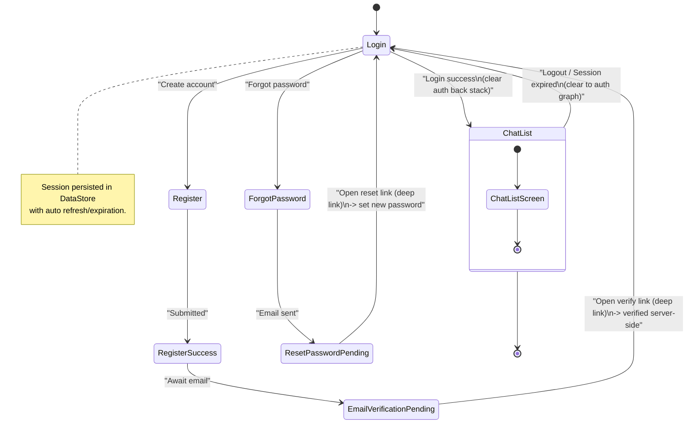
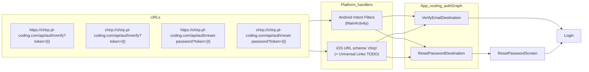

# Chirp

A Kotlin Multiplatform (KMP) application targeting Android and iOS using Compose Multiplatform. The repository is organized as a multi-module project with shared core modules and feature modules.

This README covers the stack, requirements, setup, run/build/test commands, useful Gradle tasks, environment variables, project structure, and licensing. Unknowns are explicitly marked as TODO.

## Overview
- Platforms: Android, iOS
  - Note: Desktop/JVM target is not configured in `composeApp` (no desktop source set or entry point found). See TODO in Run/Build.
- UI: JetBrains Compose Multiplatform
- Language: Kotlin (KMP)
- Dependency Injection: Koin
- Networking: Ktor Client
- Persistence: Room (with SQLite bundled) and AndroidX DataStore
- Concurrency/Time: kotlinx-coroutines, kotlinx-datetime
- Images: Coil 3
- Permissions (KMP): moko-permissions

Key toolchain versions (from `gradle/libs.versions.toml`):
- Kotlin: 2.2.0
- Compose Multiplatform: 1.9.0-beta01 (Compose BOM 2025.07.00)
- Android Gradle Plugin (AGP): 8.13.0
- KSP: 2.2.0-2.0.2
- Room: 2.7.2; SQLite bundle: 2.5.2
- Min SDK: 26, Target/Compile SDK: 36
- Java toolchain: 17

## Requirements
- JDK: Java 17. Ensure your IDE and Gradle toolchain use JDK 17.
- Gradle Wrapper (included)
  - Windows: `.\gradlew.bat`
  - macOS/Linux: `./gradlew`
- Android Studio with Android SDK Platform 36 and matching build tools
- Xcode (for building/running iOS on macOS)

### Package manager and build tooling
- Build system: Gradle 8.x (wrapper checked in), Kotlin DSL with a version catalog (`gradle/libs.versions.toml`).
- Plugins and dependency versions are controlled via the catalog and custom convention plugins under `build-logic/convention`.

Notes
- On non‑macOS machines, iOS Kotlin/Native targets will be disabled during configuration. This is expected and harmless for Android work.

## Setup
1. Clone the repository.
2. Open in Android Studio (recommended) or IntelliJ IDEA with KMP support.
3. Let Gradle sync and download dependencies.
4. Ensure local Android SDK is configured (Android Studio manages `local.properties`).
5. For iOS, open `iosApp/iosApp.xcodeproj` in Xcode when running on macOS.

## Entry points
- Android: `composeApp/src/androidMain/kotlin/dev/gaddal/chirp/MainActivity.kt` hosts the `App()` composable.
- Shared UI root: `composeApp/src/commonMain/kotlin/dev/gaddal/chirp/App.kt`.
- iOS: `composeApp/src/iosMain/kotlin/dev/gaddal/chirp/MainViewController.kt` provides the view controller; frameworks are produced from `composeApp` and the `iosApp` Xcode project wraps and launches the UI.

## Run / Build
The application module is `:composeApp`.

Android (assemble debug APK)
- Windows: `.\gradlew.bat :composeApp:assembleDebug`
- macOS/Linux: `./gradlew :composeApp:assembleDebug`

Android (install/run on connected device or emulator)
- Windows: `.\gradlew.bat :composeApp:installDebug`
- macOS/Linux: `./gradlew :composeApp:installDebug`
- Then launch from the device/emulator apps list.

Android (release builds)
- Assemble: `.\gradlew.bat :composeApp:assembleRelease` (configure signing locally)
- Bundle AAB: `.\gradlew.bat :composeApp:bundleRelease`

List tasks
- Per-module: `.\gradlew.bat :composeApp:tasks`

iOS
- Open `iosApp` in Xcode and run on Simulator or device. Frameworks are produced from `composeApp` iOS targets.
- On non‑macOS hosts, iOS targets are disabled at configuration time (expected and harmless).

Desktop/JVM
- TODO: No Desktop target/tasks are present (e.g., `:composeApp:run`, `:composeApp:packageDistributionForCurrentOS`). If Desktop support is desired, add a JVM/desktop target and entry point and document commands here.

Clean / Build all
- Windows: `.\gradlew.bat clean build`
- macOS/Linux: `./gradlew clean build`

## Useful Gradle tasks
Root/common tasks
- `:clean` — cleans the build
- `:build` — builds all modules
- `:test` — runs unit tests across modules

composeApp
- `:composeApp:assembleDebug` — builds Android debug APK
- `:composeApp:assembleRelease` — builds Android release APK (signing must be configured locally)
- `:composeApp:lint` / `:composeApp:lintFix` — run Android lint and attempt automatic fixes

Testing tasks (see Tests section for details)
- `:<module>:testDebugUnitTest` — Android JVM unit tests (debug variant)
- `:<module>:testReleaseUnitTest` — Android JVM unit tests (release variant)
- `:<module>:connectedDebugAndroidTest` — instrumented tests on device/emulator (if configured)

Build logic
Convention plugins live under `build-logic/convention` and are applied via the version catalog (see `gradle/libs.versions.toml`). Relevant plugin IDs registered in `build-logic`:
- `dev.gaddal.convention.android.application` — Android app basics (namespace, packaging, build types, versioning from the catalog); delegates to shared Kotlin/Android config.
- `dev.gaddal.convention.android.application.compose` — Adds Compose build features and BOM/tooling to Android app modules.
- `dev.gaddal.convention.cmp.application` — KMP app with Android + iOS targets, Compose plugins; Android target JVM 17; iOS targets configured as static frameworks.
- `dev.gaddal.convention.kmp.library` — KMP library with Android + iOS targets, Kotlin serialization, common test deps; sets Android `resourcePrefix` and enables Android resources in KMP CLI builds; configures compiler opt-ins.
- `dev.gaddal.convention.cmp.library` — Adds Compose deps/plugins for KMP libraries (UI, Foundation, Material3, Material Icons); debug tooling on Android.
- `dev.gaddal.convention.cmp.feature` — Convenience plugin to set up a Compose-enabled KMP feature library (composes `kmp.library` + Compose plugins/deps).
- `dev.gaddal.convention.buildkonfig` — Wires BuildKonfig with package name derived from project path and expects an `API_KEY` in `local.properties`.
- `dev.gaddal.convention.room` — Wires Room + KSP across Android/iOS (runtime + sqlite-bundled; KSP for Android and iOS targets); sets `schemas` dir per module.

Notable conventions and helpers
- Android/Kotlin settings: Java/Kotlin toolchains target JVM 17; core library desugaring enabled with `android-desugarJdkLibs`.
- KMP Android target: `jvmTarget = 17` via `configureAndroidTarget`.
- KMP compiler flags: `-Xexpect-actual-classes`, opt-ins for `kotlin.RequiresOptIn` and `kotlin.time.ExperimentalTime`.
- Namespaces/resource prefixes: library modules derive `namespace` and `resourcePrefix` from Gradle path using helpers in `PathUtil.kt`.
  - `pathToPackageName()` converts `:core:domain` -> `dev.gaddal.core.domain`.
  - `pathToResourcePrefix()` converts `:feature:chat:data` -> `feature_chat_data_`.
- iOS framework names:
  - App plugin (`cmp.application`): static frameworks with baseName `ComposeApp`.
  - Library plugin (`kmp.library`): baseName derived from module path via `pathToFrameworkName()` (camel-cased).
- Compose BOM/tooling: app and Compose-enabled modules import the BOM; debug-only UI tooling and previews added for Android.

## Environment variables and configuration
No global environment variables are required for a basic build.

BuildKonfig (per-module, optional)
- Some modules apply `dev.gaddal.convention.buildkonfig`. When applied, you MUST define `API_KEY` in `local.properties` at the repo root, or the build will fail.
  - Example entry in `local.properties` (do not commit this file):
    - `API_KEY=your_value_here`
  - Modules that currently apply this convention (as of 2025-11-16):
      - `core:data`
      - `feature:chat:data`
  - Generated package name for BuildKonfig is derived from the module path via `pathToPackageName()`.

Potential future configuration
- API endpoints/keys for Ktor — consider using BuildKonfig or another secure mechanism for non‑secret config; avoid committing secrets.
- Android release signing — configure locally, do not commit keystores.

TODO
- Document any additional environment variables or service credentials once integrated.

## Tests
Global unit tests
- Windows: `.\gradlew.bat test`
- macOS/Linux: `./gradlew test`

Module‑specific Android JVM unit tests
- Debug: `.\\gradlew.bat :<module>:testDebugUnitTest`
- Release: `.\\gradlew.bat :<module>:testReleaseUnitTest`

Instrumented/device tests (when configured for a module)
- Windows: `.\\gradlew.bat :<module>:connectedDebugAndroidTest`

iOS tests
- Tasks like `:<module>:iosX64Test` or `:<module>:iosSimulatorArm64Test` will run only on macOS with proper toolchains.

Notes
- The KMP library convention adds `commonTestImplementation(kotlin("test"))`. AGP maps `kotlin.test` to JUnit on Android unit tests.
- Some modules may still use legacy `src/test/kotlin`; Gradle may print a deprecation notice recommending `src/androidUnitTest/kotlin`. Prefer the new path going forward.

## Project structure
Modules (from `settings.gradle.kts`)
- `composeApp` — KMP application module (Android + iOS)
- core
  - `core:presentation`
  - `core:domain`
  - `core:data`
  - `core:designsystem`
- feature:auth
  - `feature:auth:presentation`
  - `feature:auth:domain`
- feature:chat
  - `feature:chat:presentation`
  - `feature:chat:domain`
  - `feature:chat:data`
  - `feature:chat:database`
- `iosApp` — Xcode project wrapper to run the iOS app

Notable source locations
- `composeApp/src/commonMain/kotlin` — shared UI/logic
- `composeApp/src/androidMain` — Android sources and `AndroidManifest.xml`
- `composeApp/src/iosMain` — iOS Kotlin code and interop
- `iosApp/` — Swift/SwiftUI wrapper and app entry for iOS

Root directories (repo top-level)

- `build-logic/` — custom Gradle convention plugins
- `composeApp/` — KMP application sources
- `core/` — shared core modules (data/domain/designsystem/presentation)
- `feature/` — feature modules (auth, chat, etc.)
- `iosApp/` — Xcode wrapper project
- `docs/` — documentation
- `gradle/`, `gradlew*`, `settings.gradle.kts`, `build.gradle.kts` — build system

Build and configuration conventions
- Plugins are declared via the version catalog in the root `build.gradle.kts`; modules apply conventions per need.
- Reusable convention plugins: `build-logic/convention` (applied via aliases from the catalog).

## Multilingual support
Chirp ships with multilingual support and right-to-left (RTL) handling. The current, validated locales are English (`en`) and Arabic (`ar`).

What’s implemented
- Centralized language state via `LanguageManager` (validation, normalization, and state): `core/presentation/.../LanguageManager.kt`.
- Platform locale application via `LocaleApplier` (expect/actual) injected into `LanguageManager`.
    - Android: uses `AppCompatDelegate.setApplicationLocales(...)` for per‑app locales on API 33+
      with a sensible fallback for host JVM/Desktop parity:
      `core/presentation/.../Language.android.kt`.
    - iOS: updates `AppleLanguages` in `NSUserDefaults`: `core/presentation/.../Language.ios.kt`.
- RTL layout direction via `ProvideMultilingualSupport(languageCode)` which sets `LocalLayoutDirection` based on known RTL languages (`ar`, `fa`, `he`, `ur`): `core/presentation/.../Rtl.kt`.
- Typography mapping with Arabic-script friendly `Cairo` when language is Arabic-like; `PlusJakartaSans` otherwise: `core/designsystem/.../Type.kt` (`typographyForLanguage`).
- Language lifecycle: `MainViewModel` loads persisted language on startup and applies it before UI renders; exposes `changeLanguage(code)`.
- Resource parity maintained across modules that own UI strings (e.g., `core/presentation`, `feature/auth/presentation`).
- Platform DI provides `LocaleApplier` in:
  `core/presentation/.../di/CorePresentationModule.(android|ios).kt`.

Where strings live (Compose Multiplatform resources)
- Per module, under `src/commonMain/composeResources/values/strings.xml`.
- Localized variants go under `values-<lang>` (e.g., `values-ar/strings.xml`).
- Example:
  - `core/presentation/src/commonMain/composeResources/values/strings.xml`
  - `core/presentation/src/commonMain/composeResources/values-ar/strings.xml`
  - `feature/auth/presentation/src/commonMain/composeResources/values/strings.xml`
  - `feature/auth/presentation/src/commonMain/composeResources/values-ar/strings.xml`

How to add a new locale
1) Mirror base strings in each module that owns UI strings: create `values-<lang>` and copy keys 1:1, translating values.
2) Keep plurals/arrays in parity across locales.
3) If the new locale is RTL (e.g., `fa`, `he`, `ur`), ensure `isRtlLanguage` includes its primary language code.
4) If the locale uses Arabic script, typography will already switch to `Cairo` via `typographyForLanguage`.
5) Add the language label(s) to any selection UI (e.g., `feature/auth/presentation` language picker).

How language is applied at runtime

- On app start, `MainViewModel` reads `SettingsStorage` and calls
  `LanguageManager.setLanguage(initCode)`, which in turn delegates to the injected `LocaleApplier`
  and updates state.
- Root UI is wrapped with `ChirpTheme(languageCode)` and `ProvideMultilingualSupport(languageCode)` so fonts and layout direction reflect the current language.
- In-app switching calls `MainViewModel.changeLanguage(code)` which persists the choice and applies it immediately.

Supported locales today
- `en` (default)
- `ar`

Android per‑app locales

- Implemented via `LocaleApplier` using `AppCompatDelegate.setApplicationLocales(...)` on API 33+
  with fallback behavior retained for parity. See `docs/i18n.md` and
  `docs/i18n-implementation-plan.md` task 7.

Troubleshooting
- Layout direction doesn’t flip: ensure `ProvideMultilingualSupport(languageCode)` wraps your root and that the `languageCode` is the normalized primary tag (e.g., `ar`).
- Fonts look off for Arabic: verify `typographyForLanguage(languageCode)` is used by your theme and Cairo fonts are present in generated resources.
- Strings don’t change after switching: confirm `LanguageManager.setLanguage(code)` returns `true` (supported), and `SettingsStorage.setLanguage(code)` is called.
- Tests show unresolved opt-ins for coroutines: add appropriate kotlinx-coroutines test deps or remove unused opt-ins (harmless for simple unit tests).

Quick validation (manual)
- First run with no saved language: gate to Language Selection → pick `ar` → Continue → no pre-content flicker.
- Relaunch persists `ar`, RTL direction is applied, Cairo typography visible.
- Switch back to `en` in-app; changes apply instantly and persist.
- Auth screens show localized strings; representative error messages are localized.

Build/run tips (Windows)
- Build all: `.\\gradlew.bat build`
- Run Android debug APK: `.\\gradlew.bat :composeApp:assembleDebug`

## Authentication and Deep Links

- Flows (see CHANGELOG 0.5.0–0.7.0): Register → Register Success → Email Verification (deep link), Login (session persistence), Forgot Password, Reset Password (deep link). Session uses DataStore with auto refresh/expiration.
- Navigation: Auth graph starts at `AuthGraphRoutes.Login`; on successful login, navigate to `ChatListRoute` and clear the auth back stack.
- Deep links handled in `authGraph`:
  - Verify: `https://chirp.pl-coding.com/api/auth/verify?token={token}` and `chirp://chirp.pl-coding.com/api/auth/verify?token={token}`
  - Reset: `https://chirp.pl-coding.com/api/auth/reset-password?token={token}` and `chirp://chirp.pl-coding.com/api/auth/reset-password?token={token}`
- Platform setup:
  - Android: `MainActivity` intent filters for HTTPS (App Links, `android:autoVerify="true"`) and `chirp://` scheme; host `chirp.pl-coding.com`, paths `/api/auth/verify` and `/api/auth/reset-password`.
  - iOS: custom URL scheme `chirp` present in Info.plist; Universal Links for HTTPS are TODO (Associated Domains + AASA).
- References: `feature/auth/presentation/.../AuthGraph.kt`, `composeApp/.../NavigationRoot.kt`, `CHANGELOG.md`.

### Auth flow diagram (navigation/state)

### Deep link routing diagram

Notes
- After successful verification/reset via deep link, we route users back to the `Login` screen (or auto-navigate to `ChatList` if a valid session is present).
- Ensure tokens are consumed server-side; the app treats the link as an entry point and updates UI state accordingly.

## License
No LICENSE file found in the repository.

TODO
- Add a LICENSE file (e.g., Apache‑2.0 or MIT) and update this section.

## Changelog
See `CHANGELOG.md` for notable changes.
