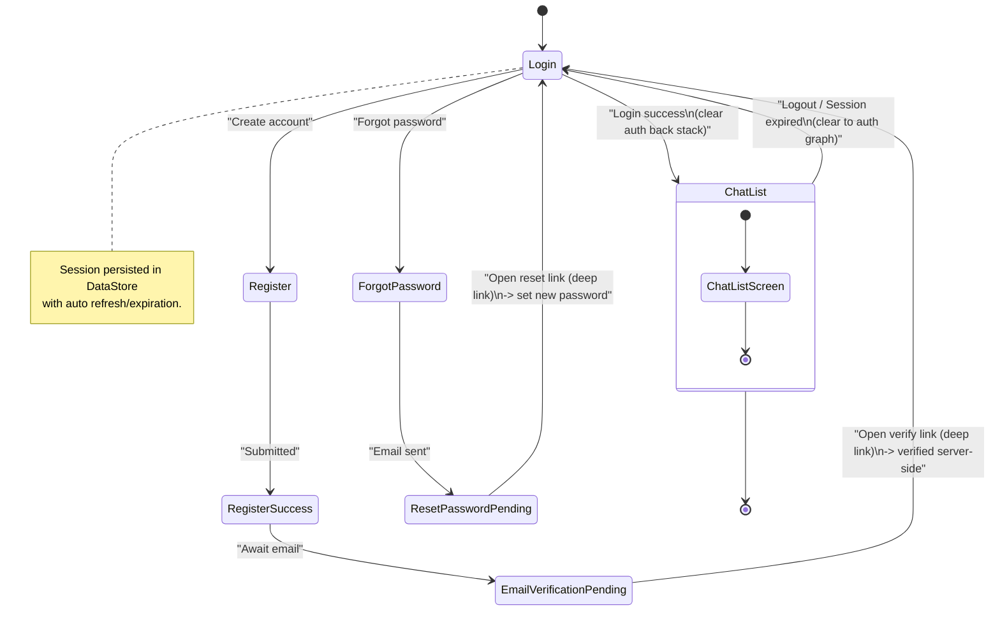
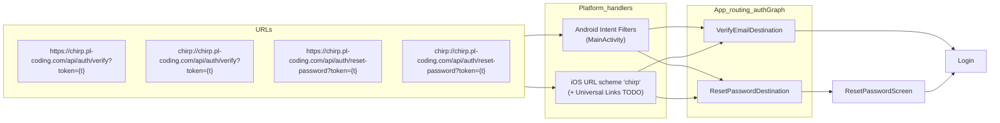

# Authentication & Deep Links

This document summarizes authentication flows and deep link handling across platforms.

## Flows

- Register → Register Success → Email Verification (deep link)
- Login (session persistence via DataStore)
- Forgot Password → Reset Password (deep link)
- On successful login, navigate to `ChatListRoute` and clear auth back stack

Deep links handled in `authGraph`:

- Verify: `https://chirp.pl-coding.com/api/auth/verify?token={token}` and
  `chirp://chirp.pl-coding.com/api/auth/verify?token={token}`
- Reset: `https://chirp.pl-coding.com/api/auth/reset-password?token={token}` and
  `chirp://chirp.pl-coding.com/api/auth/reset-password?token={token}`

Platform setup:

- Android: `MainActivity` intent filters for HTTPS (App Links, `android:autoVerify="true"`) and
  `chirp://` scheme; host `chirp.pl-coding.com`, paths `/api/auth/verify` and
  `/api/auth/reset-password`.
- iOS: custom URL scheme `chirp` in Info.plist; Universal Links for HTTPS are TODO (Associated
  Domains + AASA).

References:

- `feature/auth/presentation/.../AuthGraph.kt`
- `composeApp/.../NavigationRoot.kt`
- `CHANGELOG.md`

## Auth Flow Diagram

## Deep Link Routing Diagram

Notes:

- After verification/reset via deep link, route back to `Login` (or auto-navigate to `ChatList` when
  a valid session is present).
- Ensure tokens are consumed server-side; the app treats the link as an entry point and updates UI
  state accordingly.
