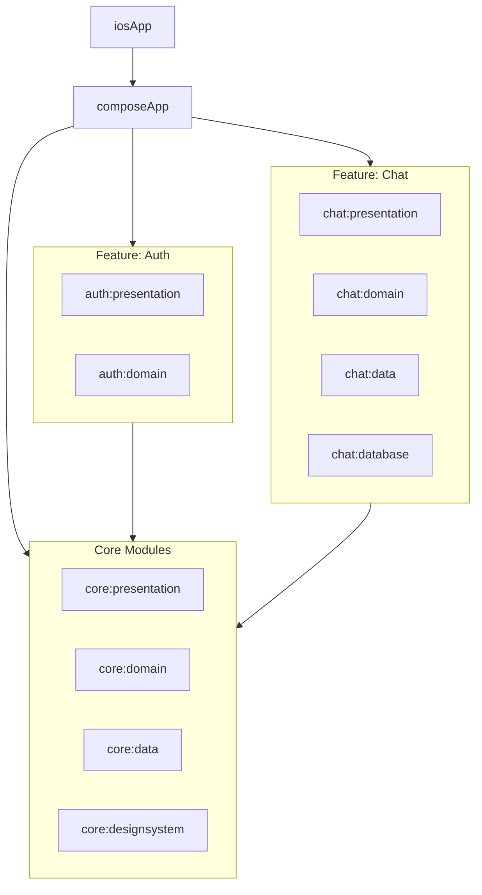

# Project Structure

This document provides a comprehensive overview of Chirp's modular architecture, module
responsibilities, and key source locations.

## Table of Contents

- [Overview](#overview)
- [Module Design](#module-design)
- [Module Structure Diagram](#module-structure-diagram)
- [Directory Layout](#directory-layout)
- [Entry Points](#entry-points)
- [Notable Source Locations](#notable-source-locations)

## Overview

Chirp follows a multi-module architecture with clear separation between:

- **Application Module** — Platform-specific app entry points
- **Core Modules** — Shared functionality across features
- **Feature Modules** — Self-contained feature implementations
- **Platform Wrappers** — iOS Xcode project

## Module Design

| Module                      | Type            | Description                                                  |
|-----------------------------|-----------------|--------------------------------------------------------------|
| `composeApp`                | KMP Application | Main application module (Android + iOS + Desktop)            |
| **Core Modules**            |                 |                                                              |
| `core:presentation`         | KMP Library     | Shared presentation utilities, language management, UI state |
| `core:domain`               | KMP Library     | Core business logic, base use cases, domain models           |
| `core:data`                 | KMP Library     | Common data handling, repositories, API clients              |
| `core:designsystem`         | KMP Library     | Design system, themes, typography, reusable UI components    |
| **Feature: Auth**           |                 |                                                              |
| `feature:auth:presentation` | KMP Library     | Authentication UI, screens, ViewModels                       |
| `feature:auth:domain`       | KMP Library     | Auth business logic, use cases                               |
| **Feature: Chat**           |                 |                                                              |
| `feature:chat:presentation` | KMP Library     | Chat UI, message screens, ViewModels                         |
| `feature:chat:domain`       | KMP Library     | Chat business logic, use cases                               |
| `feature:chat:data`         | KMP Library     | Chat data sources, repositories, API integration             |
| `feature:chat:database`     | KMP Library     | Room database, DAOs, entities for chat                       |
| **Platform**                |                 |                                                              |
| `iosApp`                    | Xcode Project   | Swift/SwiftUI wrapper to run the iOS app                     |

### Module Dependencies

Each module follows these dependency rules:

- Feature modules only depend on `core` modules
- Presentation layers depend on domain layers
- Domain layers are pure Kotlin (no platform dependencies)
- Data layers implement domain interfaces
- No feature module depends directly on another feature module

## Module Structure Diagram



## Directory Layout

```
chirp/
├── composeApp/                    # KMP application sources
│   ├── src/
│   │   ├── commonMain/            # Shared UI and logic
│   │   ├── androidMain/           # Android sources + manifest
│   │   ├── iosMain/               # iOS Kotlin code
│   │   └── desktopMain/           # Desktop/JVM sources
│   └── build.gradle.kts
├── core/
│   ├── presentation/              # Shared presentation utilities
│   ├── domain/                    # Core business logic
│   ├── data/                      # Common data handling
│   └── designsystem/              # Design system and themes
├── feature/
│   ├── auth/
│   │   ├── presentation/          # Auth UI
│   │   └── domain/                # Auth business logic
│   └── chat/
│       ├── presentation/          # Chat UI
│       ├── domain/                # Chat business logic
│       ├── data/                  # Chat data layer
│       └── database/              # Chat Room database
├── iosApp/                        # Xcode wrapper project
├── build-logic/                   # Custom Gradle convention plugins
│   └── convention/
├── docs/                          # Documentation
├── gradle/                        # Gradle wrapper and version catalog
│   └── libs.versions.toml         # Dependency versions
├── conveyor.conf                  # Desktop packaging config
├── conveyorResources/             # Desktop packaging assets
├── settings.gradle.kts
└── build.gradle.kts
```

## Entry Points

| Platform   | Entry Point                                                                      | Description                           |
|------------|----------------------------------------------------------------------------------|---------------------------------------|
| Android    | `composeApp/src/androidMain/kotlin/dev/gaddal/chirp/MainActivity.kt`             | Hosts the `App()` composable          |
| Desktop    | `composeApp/src/desktopMain/kotlin/dev/gaddal/chirp/Main.kt`                     | Main class: `dev.gaddal.chirp.MainKt` |
| iOS        | `composeApp/src/iosMain/kotlin/dev/gaddal/chirp/MainViewController.kt`           | Provides view controller for iOS      |
| Shared UI  | `composeApp/src/commonMain/kotlin/dev/gaddal/chirp/App.kt`                       | Root composable                       |
| Navigation | `composeApp/src/commonMain/kotlin/dev/gaddal/chirp/navigation/NavigationRoot.kt` | Navigation graph root                 |

### Desktop-Specific Components

| Component         | Path                                                                | Purpose                   |
|-------------------|---------------------------------------------------------------------|---------------------------|
| Window Management | `composeApp/src/desktopMain/.../windows/ChirpWindow.kt`             | Multi-window, tray menu   |
| Deep Link Handler | `composeApp/src/desktopMain/.../deeplink/DesktopDeepLinkHandler.kt` | Desktop deep link routing |

## Notable Source Locations

### Shared Code

| Location                            | Purpose                          |
|-------------------------------------|----------------------------------|
| `composeApp/src/commonMain/kotlin/` | Shared UI, navigation, app logic |
| `core/*/src/commonMain/kotlin/`     | Core shared modules              |
| `feature/*/src/commonMain/kotlin/`  | Feature shared code              |

### Platform-Specific Code

| Platform | Location                    |
|----------|-----------------------------|
| Android  | `*/src/androidMain/kotlin/` |
| iOS      | `*/src/iosMain/kotlin/`     |
| Desktop  | `*/src/desktopMain/kotlin/` |

### Resources

| Resource Type       | Location                                                      |
|---------------------|---------------------------------------------------------------|
| Compose Resources   | `*/src/commonMain/composeResources/`                          |
| Strings (default)   | `*/src/commonMain/composeResources/values/strings.xml`        |
| Strings (localized) | `*/src/commonMain/composeResources/values-<lang>/strings.xml` |
| Android Manifest    | `composeApp/src/androidMain/AndroidManifest.xml`              |

### Build Configuration

| File                        | Purpose                          |
|-----------------------------|----------------------------------|
| `gradle/libs.versions.toml` | Centralized dependency versions  |
| `build-logic/convention/`   | Custom Gradle convention plugins |
| `conveyor.conf`             | Desktop packaging configuration  |
